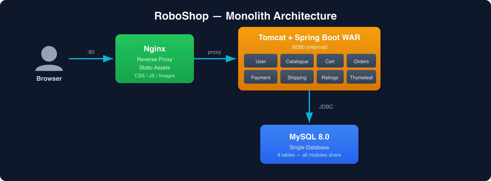

## Application Description

RoboShop Monolith is a Java Spring Boot e-commerce web application for robotics components. It is a single deployable WAR running on Tomcat with a Thymeleaf UI, served behind Nginx. All modules (User, Catalogue, Cart, Orders, Payment, Shipping, Ratings) share a single MySQL database.

## Architecture



## Components

| Component        | Port          | Role                                      |
|------------------|---------------|-------------------------------------------|
| Nginx            | 80            | Static files + reverse proxy to Tomcat    |
| MySQL 8.4        | 3306          | Relational database for all modules       |
| RoboShop App     | 8080 (internal) | Java Spring Boot WAR, all business modules |


# 01-MySQL

> **Hint** MySQL stores all application data. The monolith uses a single shared database with multiple tables for all modules.

---

## Install

> **RHEL 10 Note** The package is named `mysql8.4-server` (not `mysql-server`). RHEL 10 ships MySQL 8.4 from the AppStream repository.

Install the MySQL server package and enable it to start on boot:

```shell
dnf install -y mysql8.4-server
systemctl enable mysqld
systemctl start mysqld
```

---

## Configure

### Set Root Password

On RHEL 10, MySQL starts with the `root@localhost` user using `auth_socket` (no password). Set a password for root access:

```shell
mysql -u root -e "
  CREATE USER 'root'@'%' IDENTIFIED BY 'RoboShop@1';
  GRANT ALL PRIVILEGES ON *.* TO 'root'@'%' WITH GRANT OPTION;
  ALTER USER 'root'@'localhost' IDENTIFIED BY 'RoboShop@1';
  FLUSH PRIVILEGES;
"
```

> **Note** The password `RoboShop@1` is used throughout. If you choose a different password, update every service configuration accordingly.
### Create Application User and Database

Connect as root and provision the application database and user:

```shell
mysql -u root -pRoboShop@1 -e "
  CREATE USER IF NOT EXISTS 'roboshop'@'%' IDENTIFIED BY 'RoboShop@1';
  CREATE DATABASE IF NOT EXISTS roboshop;
  GRANT ALL PRIVILEGES ON roboshop.* TO 'roboshop'@'%';
  FLUSH PRIVILEGES;
"
```

> **Note** The schema and master data are loaded automatically by the application on first startup via Spring Boot's `spring.sql.init.mode=always`. No manual schema import is required.

---

## Verify

Test that the application user can connect and see the database:

```shell
mysql -u roboshop -pRoboShop@1 -e "SHOW DATABASES;"
```

The output should include `roboshop` in the list of databases.


# 02-Application

> **Hint** Developer has chosen Java 21 with Spring Boot 3.2 packaged as a WAR deployed on Tomcat 10. The app auto-creates the DB schema on first run.

> **Dependency** MySQL must be running and accessible before starting the application.

---

## Install

### Java 21

> **Note** The application is developed with Java 21. Install the matching JDK version to build and run it.

```shell
dnf install -y java-21-openjdk java-21-openjdk-devel
java -version
```

### Maven

Install Maven for building the application from source:

```shell
dnf install -y maven
```

### Application User

Create a dedicated system user to run the application process:

```shell
useradd -r -s /bin/false appuser
```

### Application Directory

Create the directory where the built WAR will be placed:

```shell
mkdir -p /app
```

---

## Configure

### Download and Build from Source

Download the source archive, extract it, build the WAR with Maven, and place it in `/app`:

```shell
curl -L -o /tmp/roboshop-monolith.zip https://raw.githubusercontent.com/r-devops/roboshop-monolith/artifacts/roboshop-monolith.zip
mkdir -p /tmp/roboshop-monolith
cd /tmp/roboshop-monolith
unzip /tmp/roboshop-monolith.zip
mvn clean package -DskipTests
cp target/roboshop.war /app/roboshop.war
```

### Set Ownership and Permissions

Restrict access to the application directory so only `appuser` can read and execute files:

```shell
chown -R appuser:appuser /app
chmod o-rwx /app -R
```

### Systemd Service

Create the systemd unit file at `/etc/systemd/system/roboshop.service`:

```ini
[Unit]
Description=RoboShop Monolith Application
After=network.target

[Service]
Type=simple
User=appuser
WorkingDirectory=/app
ExecStart=java -jar /app/roboshop.war
Restart=on-failure
RestartSec=10

Environment=SPRING_DATASOURCE_URL=jdbc:mysql://localhost:3306/roboshop?useSSL=false&allowPublicKeyRetrieval=true&serverTimezone=UTC
Environment=SPRING_DATASOURCE_USERNAME=roboshop
Environment=SPRING_DATASOURCE_PASSWORD=RoboShop@1
Environment=SERVER_PORT=8080

[Install]
WantedBy=multi-user.target
```

> **Important** Replace `localhost` in `SPRING_DATASOURCE_URL` with the private IP address of the MySQL server if MySQL is running on a separate server (Server 2).

---

## Start

Reload systemd so it picks up the new unit file, then enable and start the service:

```shell
systemctl daemon-reload
systemctl enable roboshop
systemctl start roboshop
```

---

## Verify

Check the service status:

```shell
systemctl status roboshop
```

Follow the live application logs:

```shell
journalctl -u roboshop -f
```

Confirm the application is accepting HTTP requests on port 8080:

```shell
curl http://localhost:8080/health
```
# 03-Nginx

> **Hint** Nginx serves static assets (CSS, JS, images) directly from disk and proxies all dynamic requests to the Tomcat application.

> **Dependency** The application (Tomcat on port 8080) must be running before configuring and starting the Nginx reverse proxy.

---

## Install

### Disable SELinux and Firewall

RHEL 10 ships with SELinux in enforcing mode and firewalld active. SELinux blocks Nginx from proxying requests to the application backend (`502 Bad Gateway`), and firewalld blocks external users from reaching port 80.

```shell
setenforce 0
systemctl stop firewalld
systemctl disable firewalld
```

> **Note** In production, configure SELinux policies and firewall rules properly instead of disabling them.

### Install Nginx

> **RHEL 10 Note** RHEL 10 dropped module streams. Nginx 1.26 is available directly from the AppStream repository.

```shell
dnf install -y nginx
systemctl enable nginx
systemctl start nginx
```

---

## Configure

### Nginx Configuration

Replace the entire contents of `/etc/nginx/nginx.conf` with the following. This configuration serves static assets from `/usr/share/nginx/html` with a 7-day browser cache and proxies all other requests to the Tomcat application:

```nginx
user nginx;
worker_processes auto;
error_log /var/log/nginx/error.log notice;
pid /run/nginx.pid;

include /usr/share/nginx/modules/*.conf;

events {
    worker_connections 1024;
}

http {
    log_format  main  '$remote_addr - $remote_user [$time_local] "$request" '
                      '$status $body_bytes_sent "$http_referer" '
                      '"$http_user_agent" "$http_x_forwarded_for"';
    access_log  /var/log/nginx/access.log  main;
    sendfile            on;
    tcp_nopush          on;
    keepalive_timeout   65;
    include             /etc/nginx/mime.types;
    default_type        application/octet-stream;

    server {
        listen 80;
        server_name _;

        location /css/ {
            root /usr/share/nginx/html;
            expires 7d;
            add_header Cache-Control "public";
        }

        location /js/ {
            root /usr/share/nginx/html;
            expires 7d;
            add_header Cache-Control "public";
        }

        location /images/ {
            root /usr/share/nginx/html;
            expires 7d;
            add_header Cache-Control "public";
        }

        location / {
            proxy_pass http://localhost:8080;
            proxy_set_header Host $host;
            proxy_set_header X-Real-IP $remote_addr;
            proxy_set_header X-Forwarded-For $proxy_add_x_forwarded_for;
            proxy_set_header X-Forwarded-Proto $scheme;
        }
    }
}
```

> **Important** Replace `localhost` in the `proxy_pass` directive with the private IP address of the application server if Nginx and the RoboShop application are running on separate servers.

### Copy Static Assets

The application source contains the static frontend assets. Copy them into the Nginx web root so they are served directly:

```shell
mkdir -p /usr/share/nginx/html/css /usr/share/nginx/html/js /usr/share/nginx/html/images
cp -r /tmp/roboshop-monolith/src/main/resources/static/css/* /usr/share/nginx/html/css/
cp -r /tmp/roboshop-monolith/src/main/resources/static/js/* /usr/share/nginx/html/js/
cp -r /tmp/roboshop-monolith/src/main/resources/static/images/* /usr/share/nginx/html/images/
```

---

## Start

Test the configuration for syntax errors, then apply it:

```shell
nginx -t
systemctl restart nginx
```

---

## Verify

Open a browser and navigate to:

```
http://<SERVER-PUBLIC-IP>
```

The RoboShop storefront should load.


